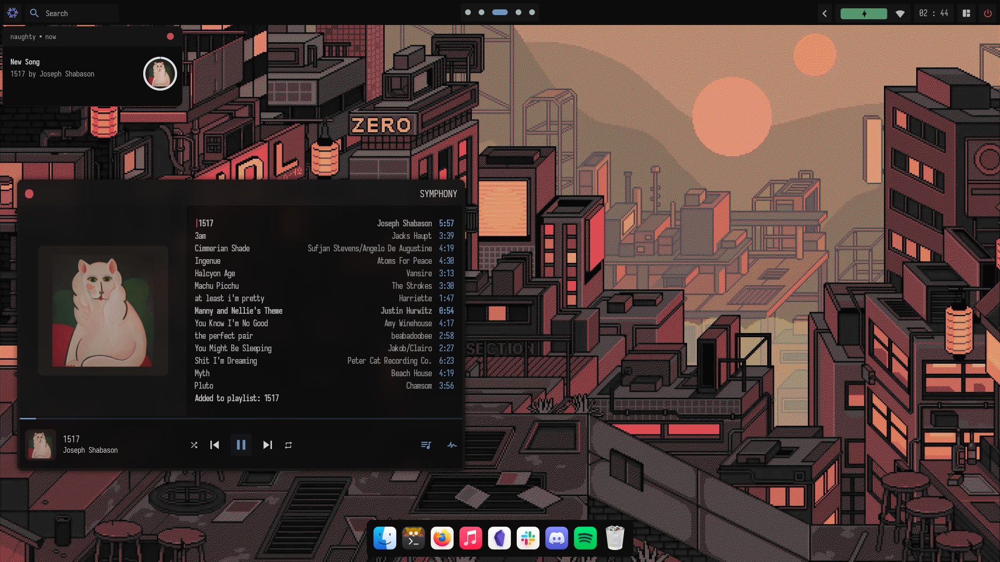

  <h1> nix-home </h1>
  
 wtf am i doing ?

> **Important**
>  # ALL CREDITS GO TO [chadcat7](https://github.com/chadcat7)
> That's basically his config adapted to my system

## I will write this later :)

> **Note**
> The awesome config is under the `awesome` branch
### The main screen
*using `verdant` colorscheme*

### nvim 
using *my personal* [config](https://git.elyth.xyz/Elyth/nvim), obviously inspired by chadcat's [kodo](https://github.com/chadcat7/kodo) </em>

### Spicetify
*using the `text` theme*

### ncmpcpp
*with custom made decorations*

