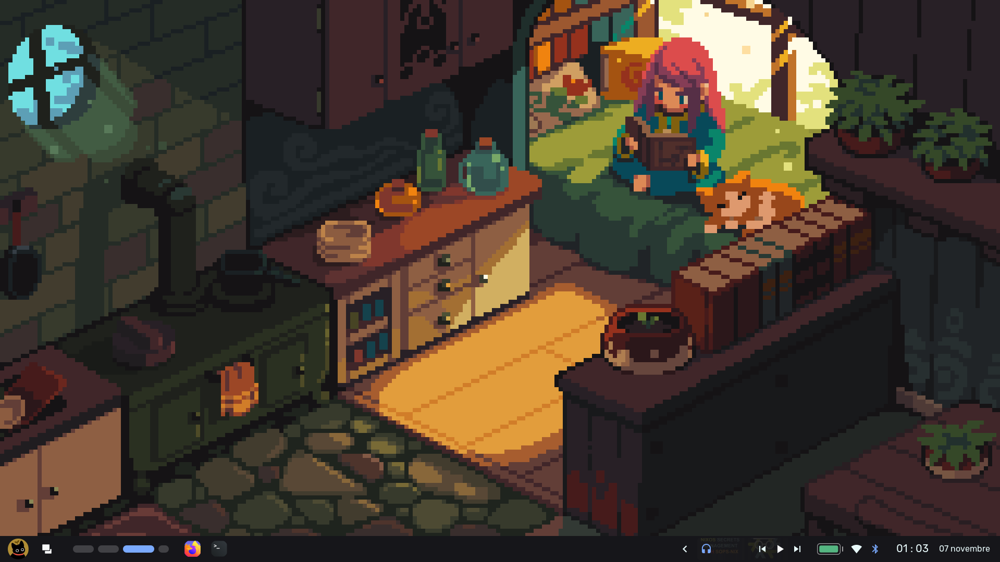
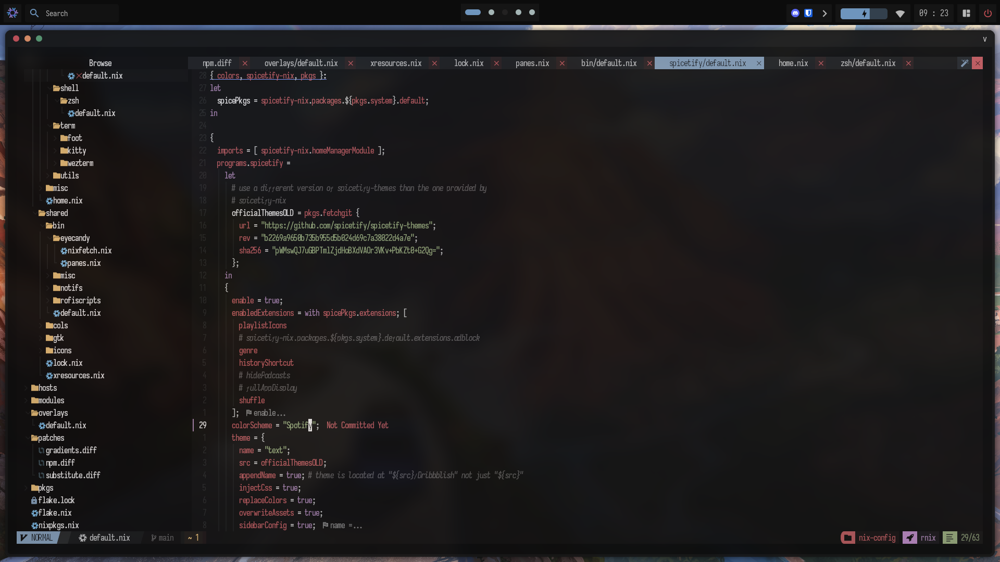
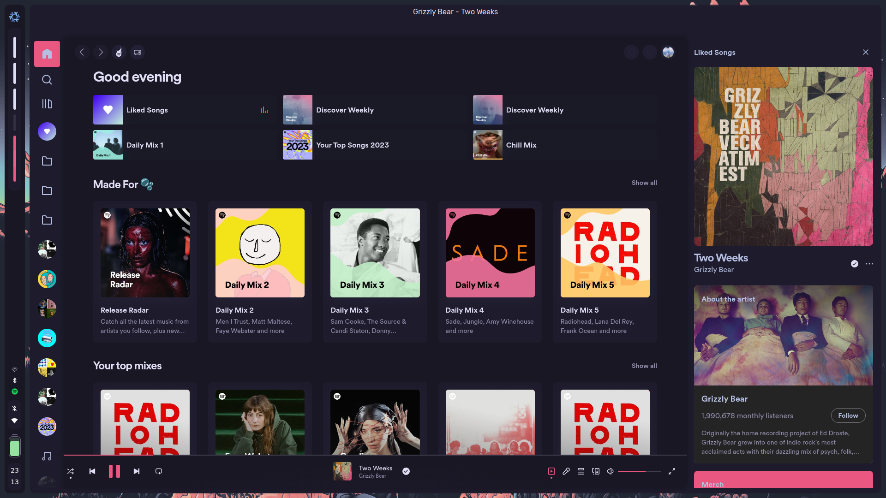
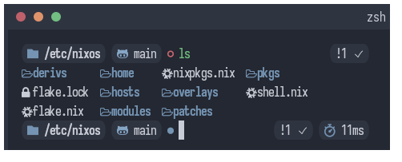
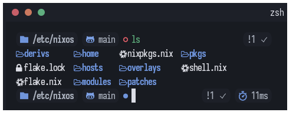
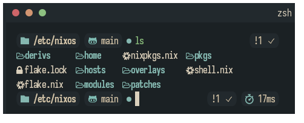
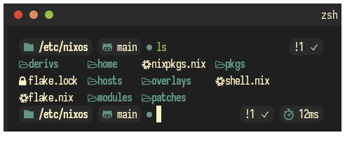
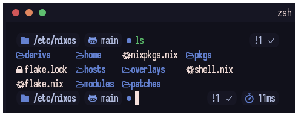
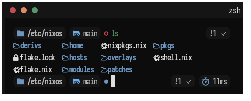
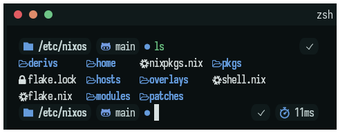

  <h1> dotfiles </h1>
  
 wtf am i doing ?

> **Important**
> I am no longer using the original `awesomewm` config, I moved the new one from [chatcat7](https://github.com/chadcat7/crystal). You can find my fork under the `awesome-v2` branch. The old one is not being maintained anymore

> **Note**
> The config for `awesomev-2` and `zsh` are under their respective branch

## Showcase

### starship

    
 arctic 

    

    
 cat 

    

    
 forest 

    

    
 groove 

    

    
 onedark 

    

    
 verdant 

    

    
 wave 

    

