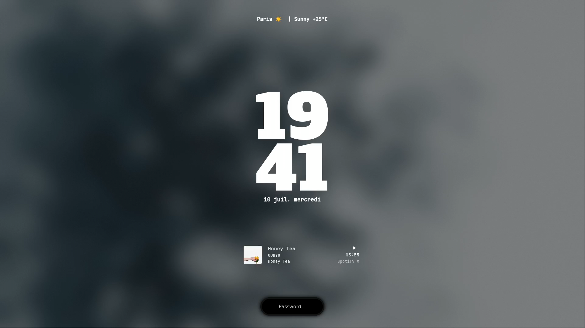

  <h1> dotfiles </h1>
  
 wtf am i doing ?

> [!Important]
>
> **General Informations**
>
> - The config for `ags/astal` and `zsh` are under their respective branches.

> [!NOTE]
>
> **System Information:**
>
> | Component      | Details                                                 |
> | -------------- | ------------------------------------------------------- |
> | OS             | NixOS ❄️                                                |
> | Window Manager | Hyprland 🧼                                             |
> | Shell          | Fish 🐟                                                 |
> | Terminal       | Foot 🦶                                                 |
> | Editor         | [Custom Nixvim flake](https://github.com/elythh/nixvim) |
> | Bar            | Astal 🍭                                                |
> | Notification   | Astal 🍭                                                |
> | Lock           | Astal 🍭                                                |

## :package: Repository Contents

- **[Home](../home):** [Home-Manager](https://github.com/nix-community/home-manager) configurations.
- **[Hosts](../hosts):** Host-specific configurations.
- **[Modules](../modules):** Every NixOS and Home-manager modules
  - **[Home](../modules/home):** Home-manager related modules
    - **[Core](../modules/home/core):** The core modules
    - **[Opt](../modules/home/opt):** Optional and togglable modules
  - **[NixOS](../modules/nixos):** NixOS related modules
    - **[Core](../modules/nixos/core):** The core modules
    - **[Opt](../modules/nixos/opt):** Optional and togglable modules

## :bulb: Acknowledgments

- [chatcat7](https://github.com/chadcat7) - my repo started as a fork from his
- [ryxhn](https://github.com/rxyhn) - for the inspiration for his nix repo also
- [kewin-y](https://github.com/kewin-y) - for the ags configuration as well as other inspirations
