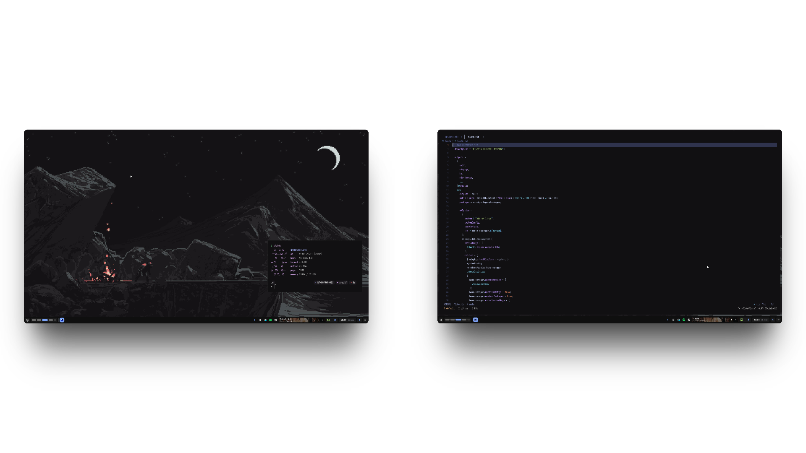
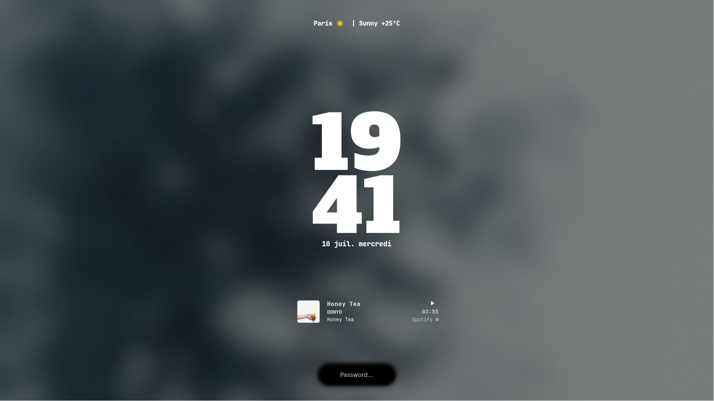
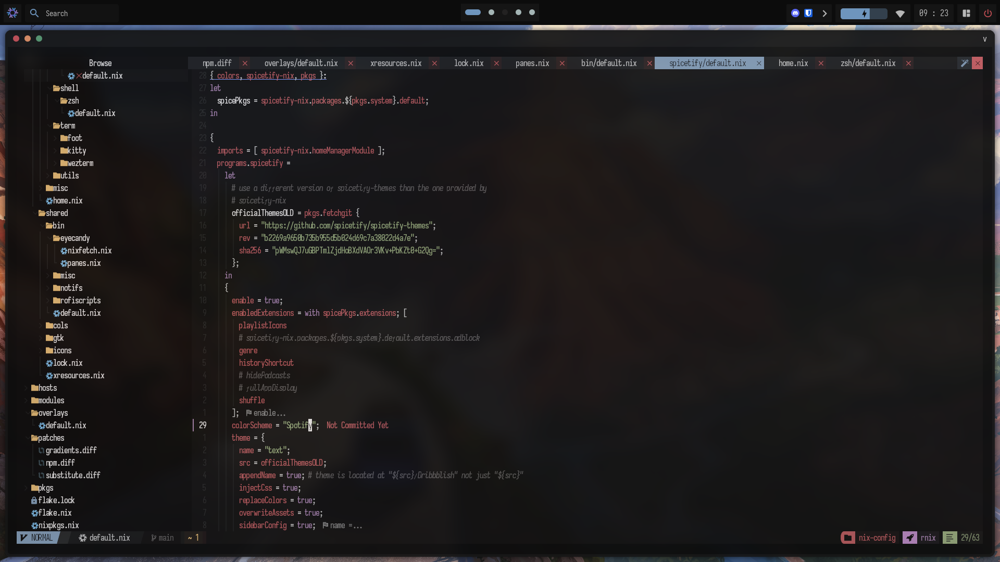

<div align="center">
  <h1> dotfiles </h1>
  <p> wtf am i doing ?</p>
</div>
<div align="center">


</div>

> [!Important]
>
> **General Information**
>
> - This repo tracks NixOS + Home Manager on `nixos-unstable`.
> - Optional shell/UI variants can live on dedicated branches.





> [!NOTE]
>
> **System Information:**
>
> | Component      | Details                                                 |
> | -------------- | ------------------------------------------------------- |
> | OS             | NixOS ❄️                                                |
> | Window Manager | Hyprland 🧼                                             |
> | Shell          | Fish 🐟                                                 |
> | Terminal       | Foot 🦶                                                 |
> | Editor         | [Custom Nixvim flake](https://github.com/elythh/nixvim) |
> | Bar            | Astal 🍭                                                |
> | Notification   | Astal 🍭                                                |
> | Lock           | Astal 🍭                                                |

## :package: Repository Contents

- **[Home](../home):** [Home-Manager](https://github.com/nix-community/home-manager) configurations.
- **[Hosts](../hosts):** Host-specific configurations.
- **[Modules](../modules):** NixOS and Home-manager modules
  - **[Home](../modules/home):** Home-manager related modules
    - **[Core](../modules/home/core):** Shared user modules
    - **[Programs](../modules/home/programs):** Program-specific modules
    - **[Services](../modules/home/services):** User services
    - **[WM](../modules/home/wm):** Window manager modules
  - **[NixOS](../modules/nixos):** NixOS related modules
    - Host/system services and platform modules

## :rocket: Validation Commands

```bash
just check
just check-voidling
just check-grovetender
just check-aurelionite
```

## :shield: Compatibility Policy

- Base channel: `nixos-unstable` via `flake.lock`.
- Automated updates happen weekly and only merge after required checks pass.
- Rebuild safety net: keep at least one known-good generation before switching hosts.
- Rollback command:
  - `sudo nixos-rebuild switch --rollback`

## :bulb: Acknowledgments

- [chatcat7](https://github.com/chadcat7) - my repo started as a fork from his
- [ryxhn](https://github.com/rxyhn) - for the inspiration for his nix repo also
- [kewin-y](https://github.com/kewin-y) - for the ags configuration as well as other inspirations
